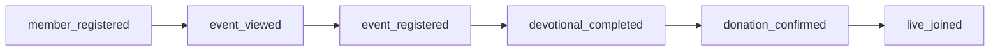

# CRH Analytics Events

## Principios

- Un evento = una decisión de producto; nombres estables en `snake_case`
- Misma semántica en app Flutter y API donde aplique
- No PII innecesaria en props (AppSec)
- Validar en `dev` antes de producción

## Embudo core congregacional

## Catálogo inicial

| Evento | Cuándo | Props mínimas |
|--------|--------|---------------|
| `member_registered` | Registro completado | `user_id`, `role` |
| `announcement_viewed` | Aviso abierto | `announcement_id` |
| `event_viewed` | Detalle evento | `event_id` |
| `event_registered` | Inscripción | `event_id`, `user_id` |
| `devotional_completed` | Día marcado leído | `plan_id`, `day` |
| `donation_submitted` | Intención donación | `type`, `amount_range` |
| `donation_confirmed` | Admin confirma | `donation_id` |
| `live_joined` | Usuario abre stream | `stream_id`, `platform` |
| `ministry_joined` | Unión a grupo | `ministry_id`, `group_id` |

## Checklist calidad

- [ ] Documentado en `docs/active_context.md` o README
- [ ] Idempotencia si el evento puede dispararse dos veces
- [ ] Backend test si hay endpoint de telemetría
