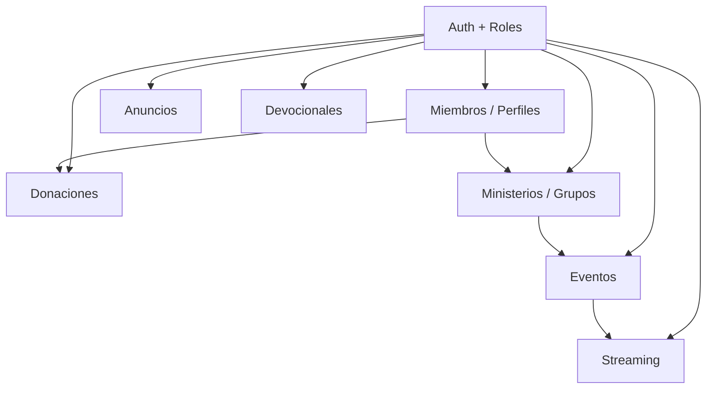

# Mapa de Módulos — Iglesia CRH

**Última actualización:** Junio 2026

## Diagrama de dependencias

## Módulos

| Módulo | Backend skill | Frontend skill | MVP |
|--------|---------------|----------------|-----|
| Auth + roles | `crh-api-patterns` | `crh-flutter-arch` | Sí |
| Miembros | `crh-members` | `crh-members-ui` | Sí (perfil básico) |
| Anuncios | `crh-announcements` | `crh-announcements-ui` | Sí |
| Eventos | `crh-events` | `crh-events-ui` | Sí |
| Devocionales | `crh-devotionals` | `crh-devotionals-ui` | Sí |
| Streaming | `crh-streaming` | `crh-streaming-ui` | Sí |
| Donaciones | `crh-donations` | `crh-donations-ui` | Fase 2 |
| Ministerios | `crh-ministries` | `crh-ministries-ui` | Fase 2 |

## Roles API

| Rol | Permisos resumen |
|-----|------------------|
| `admin` | Todo |
| `pastor` | Anuncios globales, eventos principales, reportes |
| `leader` | Su ministerio/grupo, asistencia, eventos del grupo |
| `member` | Perfil propio, inscripciones, donaciones propias, lectura |

## Orden de implementación sugerido

1. Scaffold Laravel + Flutter + auth
2. Miembros (perfil `me`)
3. Anuncios
4. Eventos
5. Devocionales
6. Streaming
7. Ministerios
8. Donaciones

## Repos

- Backend: `CRH-Backend`
- Frontend: `CRH-Frontend`
