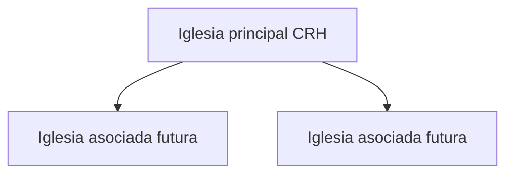
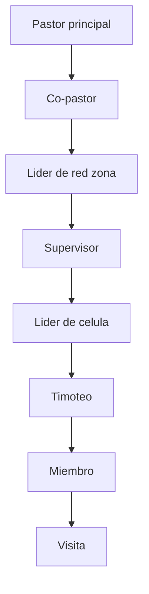
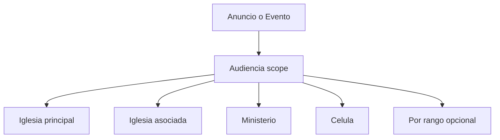
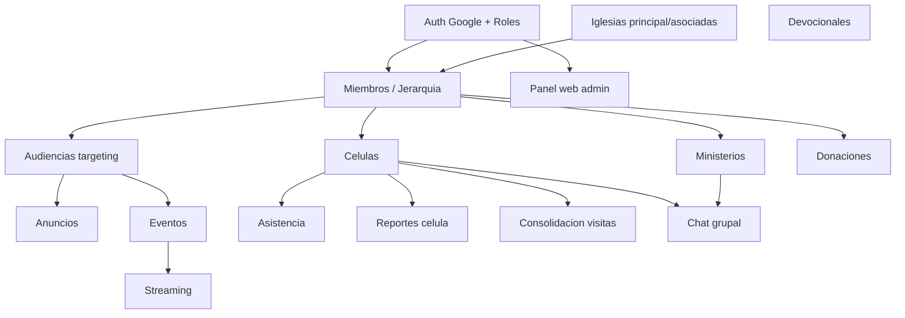

# Mapa de Módulos — Iglesia CRH

**Última actualización:** Junio 2026

> App de **iglesia celular** (G12 + clásico) con **red de iglesias** (principal + asociadas).
> Visión y catálogo: [PRODUCT_VISION.md](PRODUCT_VISION.md).

## Modelo de dominio

### Red de iglesias

Hoy: **solo 1 iglesia principal**. Tablas con `church_id`; capa asociada vacía hasta sumar otras.

### Jerarquía celular (8 niveles)

### Identidad del miembro

| Atributo | Descripción |
|----------|-------------|
| Rol / rango | Nivel en la jerarquía (visita → pastor) |
| Ministerio(s) | Áreas de servicio (N:M) |
| Célula | Grupo al que pertenece |
| Líder directo | Cadena de discipulado (quién lo pastorea) |
| Estado | Bautismo / encuentro / escuela |
| Familia | Hogar / vínculo familiar |

### Ministerios (editables en la app)

Alabanza, niños, jóvenes, damas, caballeros, intercesión, diaconado, evangelismo, matrimonios, multimedia, + otros (custom). Relación miembro–ministerio es **N:M**.

### Audiencias (targeting reusable)

Misma lógica de audiencia para **anuncios y eventos**. Visibilidad del miembro = unión de sus scopes.

## Diagrama de dependencias

## Módulos

| Módulo | Backend skill | Frontend skill | Fase |
|--------|---------------|----------------|------|
| Auth Google + roles/jerarquía | `crh-api-patterns` | `crh-flutter-arch` | MVP |
| Miembros (perfil, jerarquía, ministerios, vínculo familiar) | `crh-members` | `crh-members-ui` | MVP |
| Iglesias (principal/asociadas) | `crh-api-patterns` | `crh-flutter-arch` | MVP (base) |
| Audiencias (targeting) | `crh-api-patterns` | `crh-flutter-arch` | MVP |
| Anuncios (segmentados, fijado, lectura) | `crh-announcements` | `crh-announcements-ui` | MVP |
| Eventos (calendario, inscripción, audiencias) | `crh-events` | `crh-events-ui` | MVP |
| Devocionales (+ racha) | `crh-devotionals` | `crh-devotionals-ui` | MVP |
| Streaming (live) | `crh-streaming` | `crh-streaming-ui` | MVP |
| Push básico (urgente/fijado, recordatorio evento, en vivo) | `crh-realtime-events` | `crh-realtime-events` | MVP |
| Donaciones (+ comprobante) | `crh-donations` | `crh-donations-ui` | Fase 2 |
| Células (gestión) | `crh-ministries` | `crh-ministries-ui` | Fase 2 |
| Asistencia a célula | `crh-ministries` | `crh-ministries-ui` | Fase 2 |
| Reportes de célula | `crh-ministries` | `crh-ministries-ui` | Fase 2 |
| Consolidación de visitas | `crh-members` | `crh-members-ui` | Fase 2 |
| Chat grupal | `crh-group-chat` | `crh-group-chat-ui` | Fase 2 |
| Directorio + familias (navegable) | `crh-members` | `crh-members-ui` | Fase 2 |
| Push avanzado (segmentación por scope + chat) | `crh-realtime-events` | `crh-realtime-events` | Fase 2 |
| Panel web pastor/admin | `crh-api-patterns` | — (web) | Fase 2 |

> Nota de fases: el **vínculo familiar** se captura en el perfil del miembro (MVP); el **directorio de familias navegable** es Fase 2. El **push básico** (FCM + avisos críticos/recordatorios/en vivo) es MVP; la **segmentación avanzada por scope y push de chat** es Fase 2. Detalle: [crh/WORKSHOP_DECISIONS.md](crh/WORKSHOP_DECISIONS.md) Bloques 16 y 19.

## Roles y permisos (por scope)

| Rol | Publica a | Otros permisos |
|-----|-----------|----------------|
| `admin` | Todo | Configuración, iglesias, roles |
| `pastor` | Iglesia principal | Reportes globales, streaming, contenido |
| `copastor` | Iglesia (principal/asociada) | Apoyo pastoral |
| `red_leader` | Su red/zona | Reportes de su red |
| `supervisor` | Sus células | Coordina líderes |
| `cell_leader` | Su célula | Asistencia, reportes, consolidación de su célula |
| `ministry_leader` | Su ministerio | Comunica a su equipo |
| `timoteo` | — | Como `member` + formación de líder; puede apoyar al líder de su célula (sin permisos de publicación) |
| `member` | — | Perfil propio, inscripciones, donaciones propias, lectura |
| `visit` | — | Acceso limitado; en consolidación; oculto en directorio hasta promoción |

> Nota 1: un mismo usuario puede combinar rango de jerarquía + liderazgo de ministerio.
> Nota 2: `timoteo` es un rango de la jerarquía (líder en formación); a nivel de permisos se comporta como `member` hasta ser promovido a `cell_leader`. Promoción de roles: ver [crh/WORKSHOP_DECISIONS.md](crh/WORKSHOP_DECISIONS.md) Bloque 18.

## Orden de implementación sugerido

1. Scaffold Laravel + Flutter
2. Auth Google + iglesias (principal) + modelo miembro/jerarquía
3. Miembros (perfil `me`, ministerios, familia)
4. Audiencias (targeting reusable)
5. Anuncios (con audiencias)
6. Eventos (con audiencias + calendario)
7. Devocionales
8. Streaming
9. Fase 2: donaciones, células (asistencia/reportes/consolidación), chat, directorio, panel web

## Repos

- Backend: `CRH-Backend` (hub canónico: specs, docs, `.specify/`)
- Frontend: `CRH-Frontend` (Flutter Android first)
