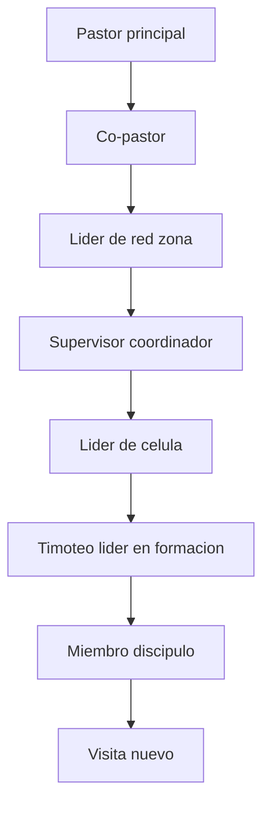
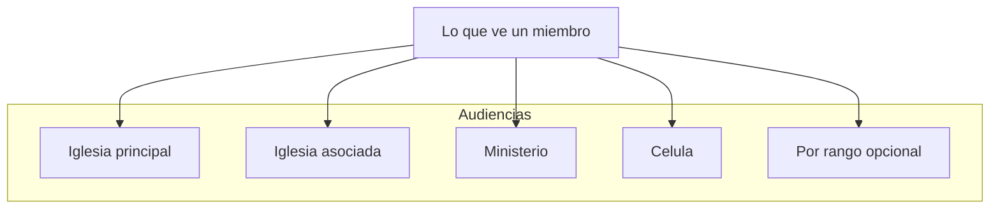

# Visión de Producto — Iglesia CRH

**Última actualización:** Junio 2026

## Qué es

App congregacional para una **iglesia celular** con **red de iglesias** (una principal + asociadas/secundarias). Conecta miembros, líderes y pastores en un solo ecosistema digital.

Piloto: **Iglesia CRH (Valencia, VE)** — hoy existe **solo 1 iglesia principal**; la capa de iglesias asociadas se modela pero queda vacía hasta sumar otras.

**No es:** red social abierta tipo feed infinito, ni ERP contable.

## Modelo de iglesia celular

Híbrido **G12 (Gobierno de los 12) + celular clásico** (redes/zonas → células → miembros).

Dos dimensiones que se modelan por separado:

- **Jerarquía de liderazgo / discipulado:** quién pastorea a quién.
- **Ministerios:** áreas de servicio (un miembro puede estar en varias).

## Problema

La comunicación congregacional fragmentada (WhatsApp, hojas impresas, grupos dispersos) dificulta:

- Saber qué eventos vienen y inscribirse
- Recibir avisos oficiales segmentados (iglesia, ministerio, célula)
- Registrar diezmos/ofrendas con trazabilidad
- Coordinar células y ministerios, asistencia y consolidación de visitas
- Acceder a devocionales y transmisiones en vivo

## Actores

| Actor | Necesidad principal |
|-------|---------------------|
| **Visita / nuevo** | Conocer la iglesia, ser consolidado |
| **Miembro / discípulo** | Eventos, avisos, devocional, donar, ver live, su célula |
| **Timoteo** | Lo de miembro + formación como líder |
| **Líder de célula** | Gestionar su célula: asistencia, avisos, reportes |
| **Supervisor / Líder de red** | Coordinar varias células de su zona |
| **Co-pastor** | Apoyo pastoral, comunicación amplia |
| **Pastor / Admin** | Comunicación global, reportes, streaming, contenido, configuración |

## Identidad del miembro

Cada persona registra:

- **Rol / rango** en la jerarquía celular
- **Ministerio(s)** donde sirve (varios posibles)
- **Célula / grupo** al que pertenece
- **Líder directo** (cadena de discipulado)
- **Estado** de bautismo / encuentro / escuela
- **Vínculo familiar** (hogar)

## Audiencias (segmentación de contenido)

Anuncios y eventos se publican a una **audiencia** (scope reusable). El miembro ve la **unión** de lo que le corresponde: **iglesia principal + su iglesia asociada + sus ministerios + su célula** (y opcionalmente por rango, ej. "solo líderes").

Reglas acordadas:

- **Permisos por scope:** pastor → principal; líder de red → su red; líder de célula → su célula; líder de ministerio → su ministerio.
- **Anuncios fijados + push obligatorio** para avisos críticos.
- **Confirmación de lectura** en anuncios críticos.
- **Evento → calendario automático** según audiencia.

## Módulos

Ver [MODULES.md](MODULES.md) para mapa técnico y dependencias.

### MVP (fase 1)

1. Auth (Google) + perfil de miembro + jerarquía/roles
2. Iglesias (iglesia principal) — base multi-iglesia
3. Audiencias (targeting reusable) — base de anuncios y eventos
4. Anuncios (feed con audiencias; fijado + push obligatorio en críticos)
5. Eventos (calendario + inscripción, con audiencias)
6. Devocional del día (+ racha)
7. Streaming embed (YouTube/Vimeo) + estado en vivo
8. Push básico (FCM): anuncio urgente/fijado, recordatorio de evento, aviso "en vivo"
9. Vínculo familiar en el perfil (el **directorio de familias** navegable es Fase 2)

### Fase 2

1. Donaciones / diezmos con comprobante
2. Células y ministerios: gestión, asistencia, reportes, consolidación
3. Directorio de miembros + familias / hogares (navegable)
4. Notificaciones push avanzadas (segmentación por scope + chat)
5. Chat grupal por célula / ministerio
6. Panel web para pastor / admin

> Detalle operativo de cada decisión (privacidad, categorías, promoción de roles, quiet hours, etc.): [crh/WORKSHOP_DECISIONS.md](crh/WORKSHOP_DECISIONS.md).

## Catálogo de funciones (acordado)

- **Plataforma:** A1 login Google, A2 perfil, A3 jerarquía celular + roles, A4 push, A5 multi-iglesia jerárquica — todas **Sí**.
- **Miembro:** B1 anuncios (segmentados), B2 eventos, B3 devocional, B4 streaming, B5 donaciones, B6 directorio, B7 familias — todas **Sí**.
- **Liderazgo/células:** C1 gestión células, C2 asistencia, C3 reportes, C4 chat, C5 panel web, C6 consolidación — todas **Sí**.

## Stack

- **Backend:** Laravel 10+, MySQL, Sanctum
- **Frontend:** Flutter (Android first; iOS/Web después)
- **Agentes IA:** Cursor + Gemini

## Métricas de éxito (piloto)

- % miembros activos mensuales
- Inscripciones a eventos vs asistencia
- Apertura de anuncios push (y confirmación de lectura)
- Completitud devocional diario
- Asistencia y crecimiento por célula
- Sesiones live concurrentes

## Fuera de alcance inicial

- ERP contable completo
- Pasarela de pago automática internacional
- Red social abierta tipo feed infinito
- Venta SaaS B2B como producto (la arquitectura multi-iglesia sí; la comercialización después)
