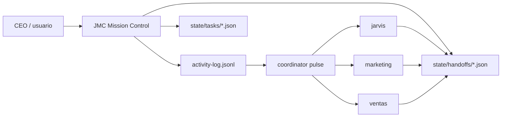

# Orquestación multi-agente — referencia (clawvis → CRH)

> **Tipo:** documento de referencia arquitectónica. CRH **no ejecuta** estos binarios hoy; describe el patrón del upstream `clawvis-openclaw` por si CRH adopta subagentes Cursor en paralelo a futuro.

**Última actualización:** 2026-06-01

---

## Qué es clawvis-openclaw

`clawvis-openclaw` es un **holding multi-agente OpenClaw** (~100 skills): agentes `jarvis`, `marketing`, `ventas`, JMC (Mission Control), modos de autonomía A–D, y scripts bash de coordinación. **No es una app de producto** — es la infraestructura IA de una agencia.

CRH ya heredó de clawvis skills de proceso: `session-learner-ops`, `deep-interview-ops`, `task-pipeline-ops`, `structured-commits-ops`, `crh-scenario-analysis`.

---

## Patrón de orquestación (clawvis)

### activity-log

- **Archivo:** `state/activity-log.jsonl` (append-only).
- **CLI:** `skills/global/activity-log/bin/activity-log`.
- **Comandos:** `start`, `event`, `tag`, `complete`.
- **Propósito:** trazabilidad de tareas, heartbeats, errores por agente.
- **Campos típicos:** `task_id`, `agent`, `kind`, `ts`, `tags[]`.

### handoff

- **Archivo:** `state/handoffs/*.json`.
- **Propósito:** contrato JSON entre agentes (de → para, payload, estado).
- **Estados:** pending, accepted, rejected, completed.

### coordinator

- **Propósito:** pulso periódico que detecta tareas estancadas, handoffs pendientes, agentes silent.
- **Integración:** lee `activity-log` + `tasks/` + `handoffs/`.

### Modos autonomía (A–D)

| Modo | Comportamiento |
|------|----------------|
| A | Solo sugerencias; usuario aprueba todo |
| B | Ejecuta tareas bajas; escala decisiones |
| C | Autonomía amplia con gates de aprobación |
| D | Máxima autonomía (holding) |

### JMC (Jarvis Mission Control)

- API read-only sobre `state/` + UI de timeline.
- Endpoints: `/v1/state/activity`, `/v1/state/handoffs`, `/v1/state/tasks`, `/v1/openclaw/gateway`.
- Ver upstream: `jarvis-ecosystem/docs/JMC_DESIGN.md`.

### Escalación async

- Payload JSON en mensajería (Telegram/Discord) + evento `kind: escalation` en activity-log.
- Gates AG-01..13 del holding (propuestas, campañas) — **no aplican a CRH**.

---

## Por qué CRH no lo necesita hoy

| Factor clawvis | Realidad CRH |
|----------------|--------------|
| Enjambre de agentes OpenClaw | Un asistente JARVIS en Cursor sobre repos Backend + Frontend |
| `state/`, dossiers, Trello | Git + `docs/active_context.md` + Spec Kit |
| Binarios bash (`activity-log`, `handoff`) | Skills Markdown + `context-updater` |
| Modos autonomía A–D | Usuario aprueba commits, implement y push |
| JMC dashboard | Cursor UI + agent transcripts |

CRH es **desarrollo de producto SaaS congregacional**, no operación de agencia multi-cliente.

---

## Criterio de adopción futura

Si CRH usa **subagentes Cursor en paralelo** (p. ej. backend + frontend + QA simultáneos):

1. **Adoptar conceptualmente** `handoff` JSON entre subagentes (contrato mínimo: input, output, criterios de aceptación).
2. **Adoptar conceptualmente** `activity-log` como append-only en `.agents/plans/` o `docs/session-log.jsonl` (sin binario bash).
3. **No clonar** JMC, Trello, dossiers ni gates AG del holding.
4. **Mapeo actual:** `crh-jarvis-subagents-map` + `jarvis-core` + Panel de Expertos.

---

## Referencias

- Upstream: `/var/www/clawvis-openclaw/jarvis-ecosystem/`
- Forense CRH: [FORENSE_CLAWVIS_RESUMEN.md](FORENSE_CLAWVIS_RESUMEN.md)
- Orquestación CRH actual: `.agents/skills/crh-jarvis-subagents-map/SKILL.md`
