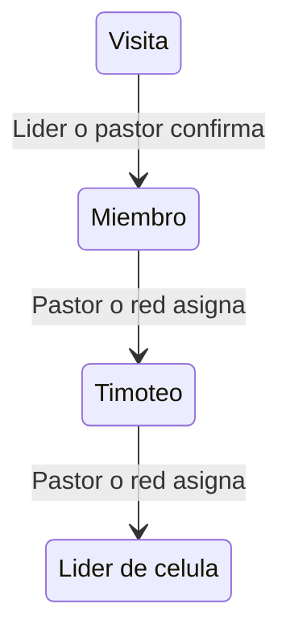

# Decisiones de Workshop — Fase 0 (Iglesia CRH)

> **Última actualización:** 2026-06-01
> **Origen:** workshop de organización con el cliente (Product Owner). Decisiones de producto previas a programación.
> **Canon de producto:** [PRODUCT_VISION.md](../PRODUCT_VISION.md), [MODULES.md](../MODULES.md). Este doc registra las decisiones operativas que alimentan specs y UI.

Los bloques 1–8 quedaron consolidados en `PRODUCT_VISION.md` y `MODULES.md`. Aquí se registran los bloques 9–21 (detalle operativo), aceptados con recomendación de consultoría.

---

## Bloque 9 — Privacidad y directorio

- **Teléfono:** visible solo para líderes de la cadena de discipulado del miembro + pastor/admin. No visible para pares.
- **Foto de perfil:** opcional.
- **Directorio:** filtrado por scopes del usuario (su célula + sus ministerios + iglesia principal). No expone toda la congregación a cualquier miembro.
- **Visitas:** ocultas en el directorio hasta promoción a `member`.

## Bloque 10 — Login Google y primer uso

- **Auth piloto:** solo Google OAuth (sin email/password).
- **Primer acceso:** wizard corto de 3 pasos (nombre, célula si la conoce, foto opcional). Resto del perfil se completa después.
- **Rol inicial:** `visit` en registro abierto; líder de célula o pastor promueve a `member`.

## Bloque 11 — Navegación MVP (app Android)

- **Tabs:** Inicio (feed anuncios) · Eventos · Devocional · Más (perfil, donar, live).
- Streaming y donaciones viven en "Más" hasta Fase 2.
- Badge "EN VIVO" en Inicio cuando hay transmisión activa.

## Bloque 12 — Donaciones VE (Fase 2)

- **Piloto/Fase 2:** registro manual (monto + referencia + foto de comprobante).
- Pago móvil con instrucciones (sin pasarela automática inicial).
- Pasarela (Stripe/local) fuera del piloto.

## Bloque 13 — Herramientas de líder (Fase 2)

- Reporte semanal de célula: asistencia, visitas, ofrenda opcional (formulario simple).
- Lista de consolidación: visitas asignadas al líder, kanban básico (nuevo → contactado → iglesia → miembro).
- Push al supervisor cuando hay reporte pendiente.

## Bloque 14 — Panel web pastor (Fase 2)

- Laravel Blade sobre los mismos endpoints API (no duplicar lógica).
- Funciones: publicar anuncio/evento con audiencia, ver reportes, gestionar ministerios/células.
- Acceso solo `pastor`/`admin`.

## Bloque 15 — Contenido y operación pastoral

- **Devocionales:** pastor/admin publica; plan diario o serie; miembro marca leído + racha.
- **Anuncios — categorías:** `general`, `urgente`, `ministerio`, `celula`, `evento`. `urgente` = fijado + push obligatorio.
- **Eventos — tipos:** `servicio`, `reunion`, `capacitacion`, `social`, `otro`.
- Publicación según permisos por scope; `visit` no publica.

## Bloque 16 — Notificaciones push

- **Push automático:** anuncio urgente/fijado; recordatorio de evento (24 h y 1 h antes); "en vivo" al iniciar stream; mensaje de chat (Fase 2).
- **Sin push por defecto:** devocional (badge in-app), donación confirmada (in-app).
- **Preferencias:** el usuario puede silenciar categorías, excepto urgente pastoral (solo pastor marca urgente).
- **Quiet hours:** 22:00–07:00 VE, salvo urgente pastoral. Canal FCM `crh_fcm`.
- **Delimitación de fase:**
  - **MVP:** FCM + anuncio urgente/fijado + recordatorio de evento + aviso "en vivo".
  - **Fase 2:** segmentación avanzada por scope + push de chat.

## Bloque 17 — Streaming

- **Proveedor piloto:** YouTube Live (embed en app); Vimeo como alternativa manual.
- **"En vivo":** lo marca pastor/admin (endpoint protegido o panel web).
- **App:** badge "EN VIVO" en Inicio; reproductor en pantalla Live; agenda de transmisiones programadas (título, fecha, enlace).

## Bloque 18 — Promoción de roles

- Registro abierto entra como `visit`.
- A `member`: líder de célula o pastor confirma (consolidación).
- Subir jerarquía: solo pastor / co-pastor / líder de red.
- Ministerio: pastor o `ministry_leader` asigna.
- **Auditoría:** log de quién cambió el rol y cuándo.

## Bloque 19 — Familias y células

- **Familia:** hogar con nombre (ej. "Familia Pérez"); varios miembros N:M; "jefe de hogar" opcional.
- **Célula:** una principal por miembro activo; cambio de célula = solicitud que líder o pastor aprueba.
- **Timoteo:** puede compartir célula con su líder.
- **Delimitación de fase:** vínculo familiar en el perfil = **MVP**; directorio de familias navegable = **Fase 2**.

## Bloque 20 — Marca y UI

- Nombre en UI: "Iglesia CRH".
- Colores: placeholders actuales (`#2C5282` primario, `#D69E2E` acento) hasta diseño final.
- Tono pastoral, español VE; sin jerga startup en pantallas de miembro.
- Logo: `[PENDIENTE asset]` — placeholder con iniciales CRH en scaffold.
- Accesibilidad: contraste AA; respeta tamaños de texto del sistema.

## Bloque 21 — Futuro multi-iglesia

- **Hoy:** una fila en `churches` = Iglesia CRH Valencia (`slug: iglesia-crh`).
- **Asociada futura:** pastor principal crea iglesia hija; usuarios con `church_id` + scopes de audiencia.
- `admin` global; pastor de iglesia asociada solo gobierna su iglesia.
- **No ahora:** billing SaaS B2B, onboarding self-service de iglesias.

---

## Referencias

- [PRODUCT_VISION.md](../PRODUCT_VISION.md) · [MODULES.md](../MODULES.md) · [active_context.md](../active_context.md)
- [BRAND_CRH.md](../BRAND_CRH.md) · [SPEC_KIT_CRH.md](SPEC_KIT_CRH.md)
